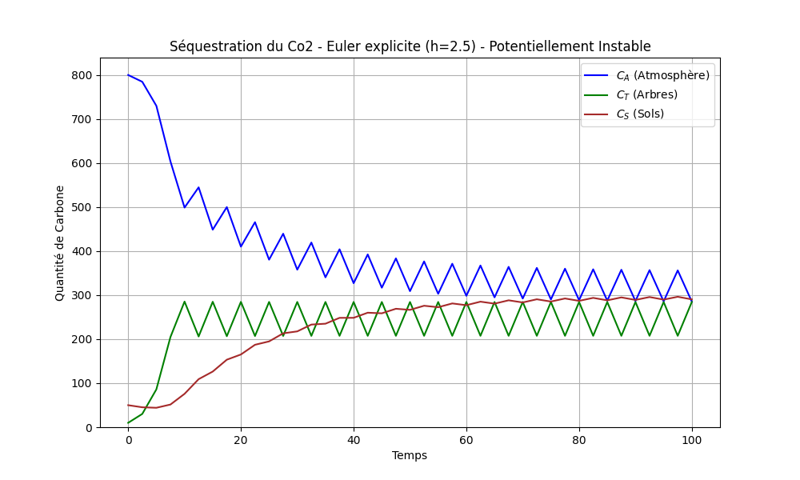
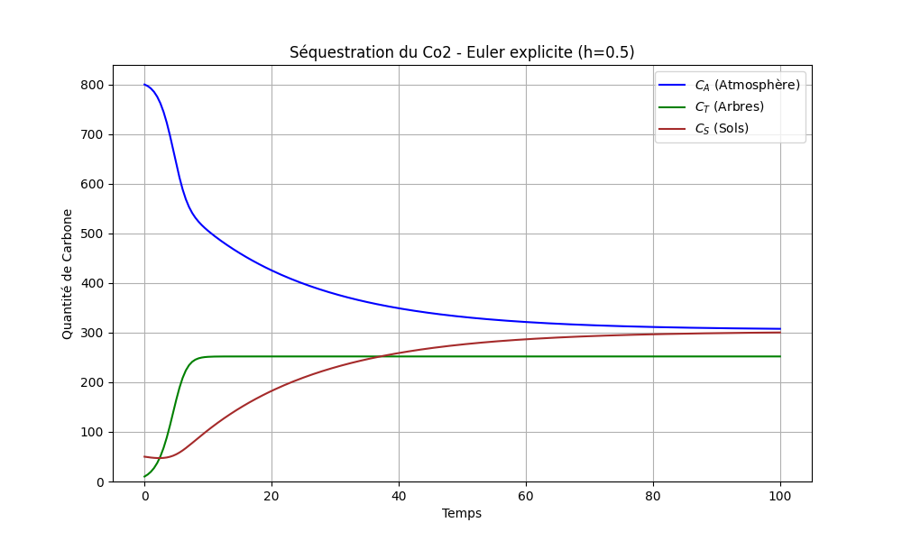
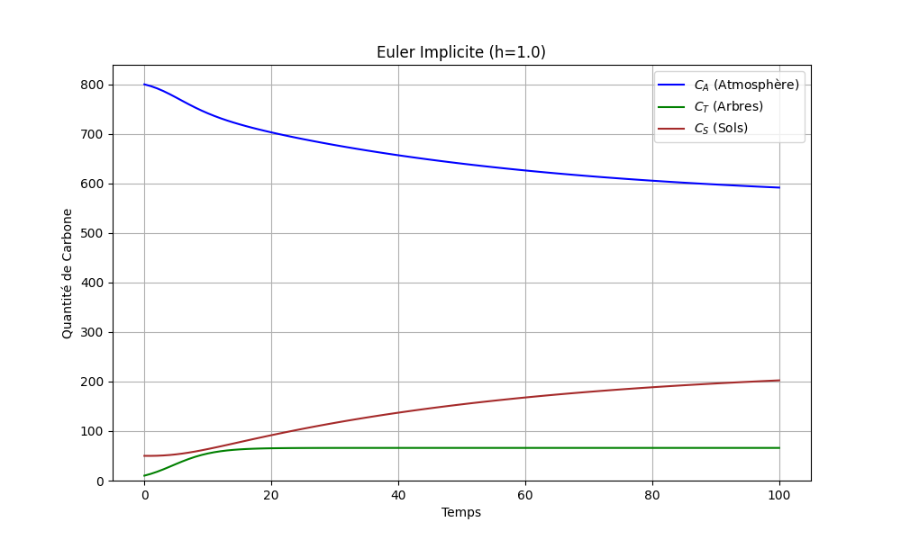
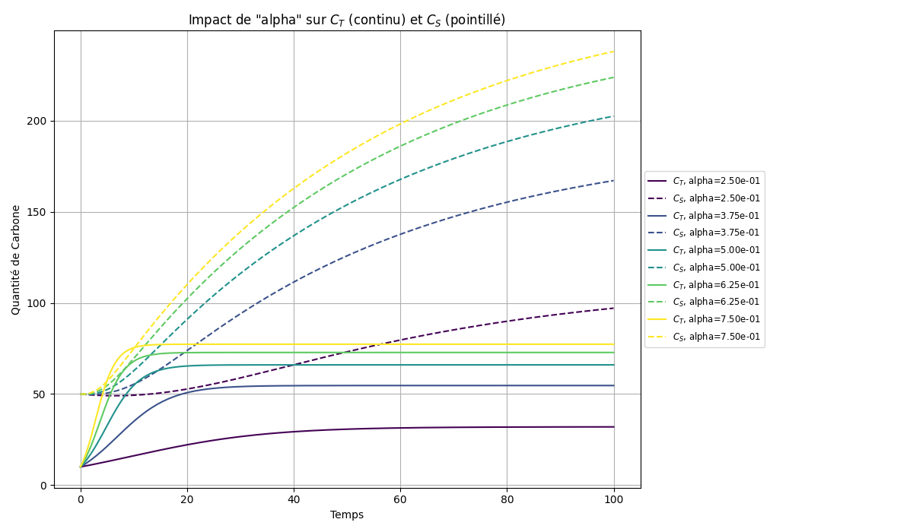
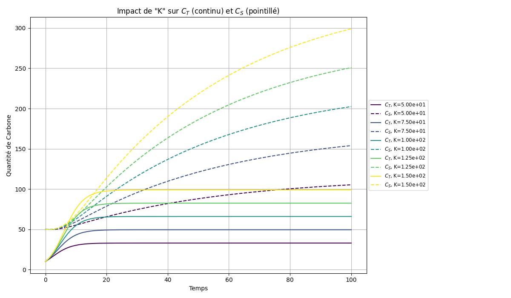
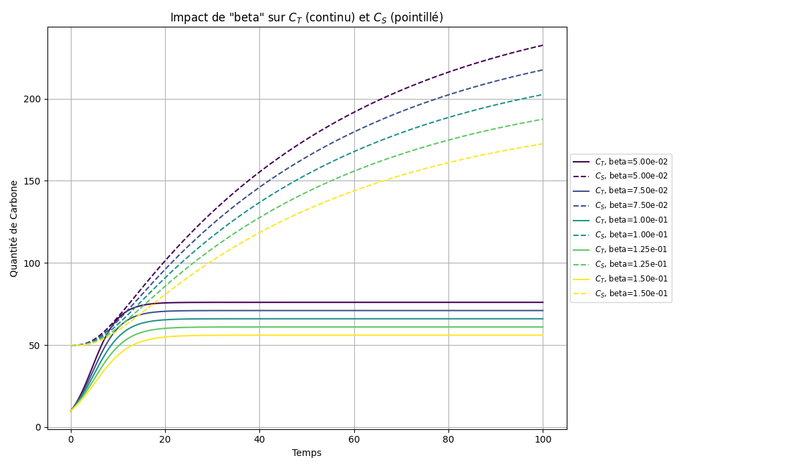
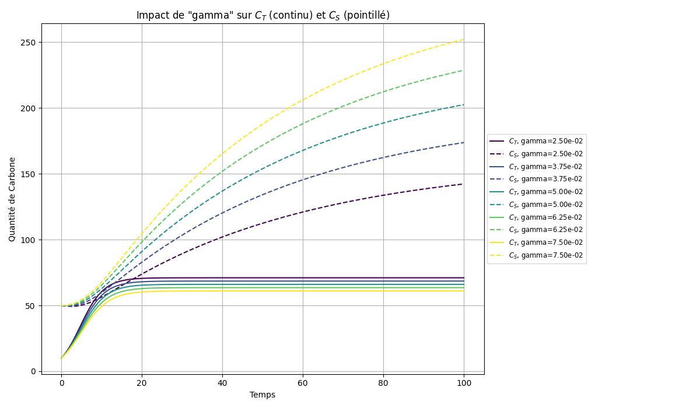
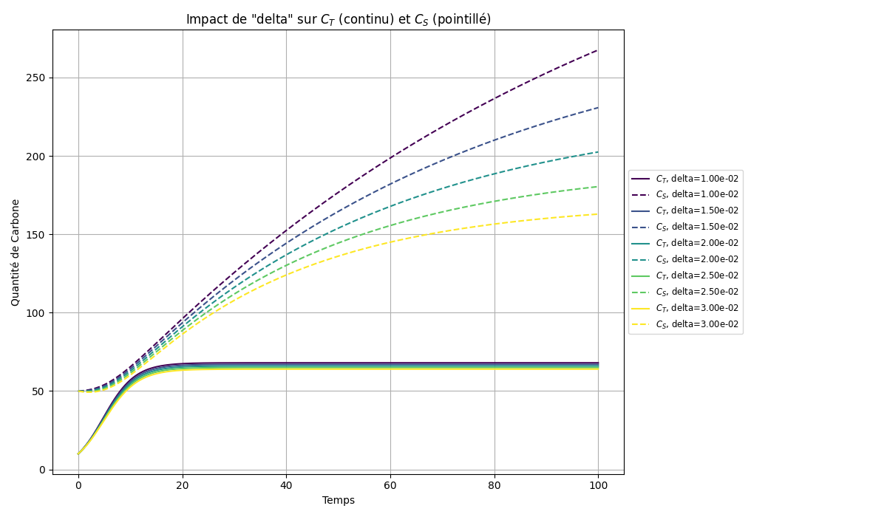

# Modeling Carbon Sequestration in Forests: A Numerical Analysis

This project presents a numerical study of a simplified carbon cycle model in a forest environment. The model, described by a system of Ordinary Differential Equations (ODEs), simulates the exchange of carbon between three main reservoirs: the atmosphere, the forest biomass (trees), and the soil.

The primary goal is to implement and compare various numerical methods (Euler Explicit, Euler Implicit, Trapezoidal Rule) to solve the system, analyze their stability, and conduct a sensitivity analysis on the model's key biological parameters to understand their influence on carbon sequestration.

This script is a self-contained Python application that allows for the reproduction of all simulations and analyses.

## Table of Contents
1.  [The Mathematical Model](#the-mathematical-model)
2.  [Numerical Solvers Implemented](#numerical-solvers-implemented)
3.  [Installation](#installation)
4.  [Usage](#usage)
5.  [Results and Analysis](#results-and-analysis)
    *   [Solver Stability Comparison](#solver-stability-comparison)
    *   [Implicit Methods Performance](#implicit-methods-performance)
    *   [Sensitivity Analysis](#sensitivity-analysis)
6.  [Conclusion](#conclusion)

---

## The Mathematical Model

The model tracks the quantity of carbon over time in three compartments:
*   $C_A(t)$: Carbon in the Atmosphere
*   $C_T(t)$: Carbon in the Trees (biomass)
*   $C_S(t)$: Carbon in the Soil

The dynamics are governed by the following system of ODEs:

$$
\begin{align*}
\frac{dC_A}{dt} &= -S(C_T) + \beta C_T + \delta C_S \\
\frac{dC_T}{dt} &= S(C_T) - (\beta + \delta + \gamma)C_T \\
\frac{dC_S}{dt} &= (\gamma + \delta)C_T - \delta C_S
\end{align*}
$$

where the carbon sequestration rate by trees, $S(C_T)$, is modeled by a logistic growth term:

$$ S(C_T) = \alpha C_T \left(1 - \frac{C_T}{K}\right) $$

The key parameters are:
*   `alpha` ($\alpha$): The intrinsic growth rate of the forest.
*   `beta` ($\beta$): The respiration rate of trees, returning carbon to the atmosphere.
*   `gamma` ($\gamma$): The litterfall rate, transferring carbon from trees to the soil.
*   `delta` ($\delta$): The soil respiration/decomposition rate.
*   `K` ($K$): The carrying capacity of the forest.

---

## Numerical Solvers Implemented

The script includes implementations for three different numerical methods to solve the ODE system:

1.  **Euler Explicit:** A simple, first-order method. It is fast but only conditionally stable, requiring a small time step `h`.
2.  **Euler Implicit:** A first-order implicit method. It is highly stable (A-stable) and robust for larger time steps, but requires solving a non-linear system at each step using a Newton-like method (`scipy.optimize.root`).
3.  **Trapezoidal Rule:** A second-order implicit method that offers a good balance of accuracy and stability. It also requires solving a non-linear system at each step.

The Jacobian of the system is explicitly defined to aid the convergence of the implicit solvers.

---

## Installation

This project requires Python and a few common scientific libraries.

1.  Clone the repository:
    ```bash
    git clone https://github.com/gt124578/Carbon_Forests_Project
    cd Carbon_Forests_Project
    ```

2.  Install the necessary libraries:
    ```bash
    pip install numpy matplotlib scipy
    ```

---

## Usage

The script `programme_final.py` is self-contained. All simulations and analyses are run by executing this single file.

To generate a specific graph or run a particular simulation, you need to edit the end of the script (`# 4. Appels des Fonctions`).

**Example:**
To run the simulation for the unstable Euler Explicit method, simply uncomment the corresponding line:

```python
# --- Exécution des solveurs simples ---

# plotrun_euler_explicite_stable(params={...}, h=0.5)
plotrun_euler_explicite_instable(params={'alpha': 1, 'beta': 0.1, 'gamma': 0.01, 'delta': 0.05, 'K': 300.0},h=2.5) # <-- UNCOMMENT THIS LINE
# plotrun_euler_implicite(h=1)
# plotrun_trapezoidal(h=1.0)
```

Then, run the script from your terminal:
```bash
python programme_final.py
```
The corresponding graph will be displayed and saved in the `results` folder. Repeat this process for any simulation you wish to run.

---

## Results and Analysis

### Solver Stability Comparison

The Euler Explicit method's stability is highly dependent on the time step `h`.

**1. Unstable Case (h = 2.5):**
With a large time step, the simulation quickly becomes unstable, showing non-physical oscillations and divergence. This highlights the limitation of explicit methods for potentially stiff systems.



**2. Stable Case (h = 0.5):**
By reducing the time step to satisfy the stability condition, the Euler Explicit method converges to a stable solution.



### Implicit Methods Performance

Implicit methods demonstrate superior stability, allowing for larger time steps without divergence.

**1. Euler Implicit (h = 1.0):**
The Euler Implicit solver converges smoothly to the correct equilibrium, even with a time step that would cause the explicit method to fail. This robustness is crucial for long-term simulations.



**2. Trapezoidal Rule (h = 1.0):**
The Trapezoidal Rule, being a second-order method, provides a more accurate solution than the first-order implicit Euler. While visually similar on this scale, it offers better precision for the same computational cost, making it a superior choice.


### Sensitivity Analysis

The sensitivity analysis reveals which parameters have the most significant impact on the forest's capacity to store carbon. In the plots below, solid lines represent tree carbon ($C_T$) and dashed lines represent soil carbon ($C_S$).

**1. Growth Rate (`alpha`):**
A higher growth rate leads to a faster and higher accumulation of carbon in both trees and soil. This is a primary driver of sequestration.



**2. Carrying Capacity (`K`):**
`K` directly limits the maximum biomass the forest can hold. Increasing `K` significantly raises the equilibrium levels of carbon in both reservoirs, making it a critical parameter for total storage potential.



**3. Tree Respiration (`beta`):**
An increase in tree respiration (`beta`) results in a substantial decrease in stored carbon, as more carbon is returned to the atmosphere. This is a major limiting factor for sequestration.



**4. Litterfall Rate (`gamma`):**
A higher `gamma` enhances the transfer of carbon from trees to soil. This leads to lower carbon storage in trees but higher storage in the soil. Its effect on the total sequestered carbon is moderate.



**5. Soil Respiration (`delta`):**
`delta` is a complex parameter that increases both the carbon flow from trees to soil and the carbon loss from soil to the atmosphere. The net effect of increasing `delta` is a significant reduction in long-term carbon storage in both compartments.



---

## Conclusion

This project successfully demonstrates the implementation and comparison of numerical methods for a biological ODE system.

*   **Key Findings:** Implicit methods (Euler Implicit, Trapezoidal) are far more suitable for this model due to their stability, allowing for more efficient simulations with larger time steps. The Trapezoidal Rule is the preferred method for its higher order of accuracy.
*   **Biological Insights:** The sensitivity analysis confirms that the growth rate (`alpha`) and carrying capacity (`K`) are the most effective levers for increasing carbon sequestration. Conversely, respiration rates (`beta` and `delta`) are the primary factors limiting the system's storage capacity.

This model serves as a strong foundation. Future work could involve incorporating environmental dependencies (temperature, precipitation), adding more detailed soil compartments, or modeling the age structure of the forest to create an even more realistic simulation.
```
